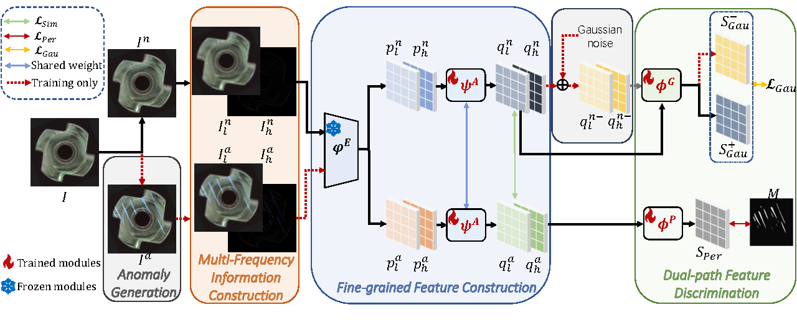

# DFD




**Dual-path Frequency Discriminators for Few-shot Anomaly Detection**

Yuhu Bai*, Jiangning Zhang*, Zhaofeng Chen, Yuhang Dong, Yunkang Cao, Guanzhong Tian† 

Paper: [arXiv:2403.04151v3](https://arxiv.org/abs/2403.04151)

##  Introduction

Few-shot anomaly detection (FSAD) plays a crucial role in industrial manufacturing. However, existing FSAD methods encounter difficulties leveraging a limited number of normal samples, frequently failing to detect and locate inconspicuous anomalies in the spatial domain. We have further discovered that these subtle anomalies would be more noticeable in the frequency domain. In this paper, we propose a Dual-Path Frequency Discriminators (DFD) network from a frequency perspective to tackle these issues.  The original spatial images are transformed into multi-frequency images, making them more conducive to the tailored discriminators in detecting anomalies. Additionally, the discriminators learn a joint representation with forms of pseudo-anomalies. 

## 🛠️ Get Started 

### Environment 

**Python3.7**

**Packages**:
- torch=1.11.0
- torchvision=0.12.0
- timm=0.9.12
- numpy=1.21.6
- opencv-python=4.7.0.72

### Dataset

Download MVTec-AD dataset from [MVTec](https://www.mvtec.com/company/research/datasets/mvtec-ad/). Download VisA dataset from [VisA](https://github.com/amazon-science/spot-diff?tab=readme-ov-file#data-download).


### Run

#### Demo train

Please specicy dataset path and log folder in `main.py` before running.

```
python main.py
```

## Citation
```
@misc{bai2024dualpathfrequencydiscriminatorsfewshot,
      title={Dual-path Frequency Discriminators for Few-shot Anomaly Detection}, 
      author={Yuhu Bai and Jiangning Zhang and Zhaofeng Chen and Yuhang Dong and Yunkang Cao and Guanzhong Tian},
      year={2024},
      eprint={2403.04151},
      archivePrefix={arXiv},
      primaryClass={cs.CV},
}
```

## Acknowledgement

We thank the great works [SimpleNet](https://github.com/DonaldRR/SimpleNet) for providing assistance for our research.

## License

All code within the repo is under [MIT license](https://mit-license.org/)